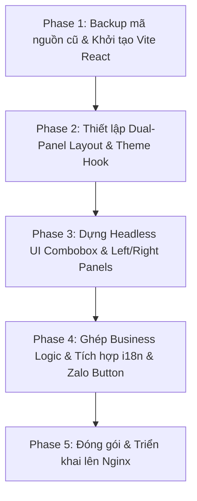

# Kế Hoạch Tái Thiết Kế & Xây Dựng Lại WebApp Tra Cứu Sáp Nhập (Vite + React)

## Bối Cảnh & Các Tiếp Thu Ý Kiến Người Dùng

1. **Loại bỏ hiệu ứng Glassmorphism**: Chuyển sang phong cách **Clean Modern UI (Chuẩn mực, Tường minh, Độ tương phản cao, Viền sắc nét, Thẻ phẳng/đổ bóng nhẹ)**. Loại bỏ 100% hiệu ứng mờ kính `backdrop-filter`.
2. **Loại bỏ phần Donate**: Không giữ lại nút Donate, Buy Me a Coffee và mã QR TPBank.
3. **Chế độ Tối/Sáng (Dark/Light Mode)**: Không bật tự động theo OS. Mặc định mở web luôn là **Light Mode**. Cung cấp nút chuyển đổi thủ công (Icon Sun/Moon) ở Header, lưu lựa chọn vào `localStorage`.
4. **Đánh giá lại Component Dropdown**: Sử dụng thư viện Headless UI **`@headlessui/react` (Combobox)** thay vì tự viết component từ đầu.
5. **Loại bỏ hệ thống thông báo (`Toast.jsx`)**: Không dùng toast notification. Các thông tin báo lỗi/chưa chọn dữ liệu sẽ hiển thị trực tiếp bằng chữ đỏ/cảnh báo ngay tại Form hoặc Bảng kết quả.
6. **Loại bỏ tính năng Feedback form**: Thay thế hoàn toàn bằng **Nút Chat Zalo** (kết nối trực tiếp qua Zalo / số điện thoại hỗ trợ `0935 691 563`).
7. **Phong cách Thiết kế & Bố cục Panel Tách Biệt**:
   - **Giữ nguyên và nâng cấp cấu trúc Bố cục 2 Panel tách biệt cao** như phiên bản hiện tại (Cảm quan 2 khối panel ghép song song trên Desktop, xếp chồng mượt mà trên Mobile).
   - **Panel Trái (Bảng Điều Khiển):** Chứa các công tắc chuyển chế độ (Cũ→Mới / Mới→Cũ / Tra nhanh), Form chọn Tỉnh/Huyện/Xã và nút Tra Cứu.
   - **Panel Phải (Bảng Kết Quả & Thông Tin):** Chứa bảng Hướng dẫn ban đầu / Bảng Kết quả sáp nhập / Nút xem địa chỉ TTHC / Thống kê Google Analytics Realtime / Nút liên hệ Chat Zalo.

---

## 📊 Đánh Giá: Tự Code Dropdown vs Dùng Thư Viện `@headlessui/react`

| Tiêu chí | Tự viết từ đầu (Custom) | Thư viện `@headlessui/react` Combobox (Được chọn) |
| :--- | :--- | :--- |
| **Độ phức tạp** | Rất cao (phải tự viết phím mũi tên, Enter, Tab, Esc, click outside, scroll containment, ARIA accessibility) | Rất thấp (thư viện của Tailwind Labs đã xử lý 100% logic ngầm) |
| **Rủi ro lỗi UI/UX** | Dễ gặp lỗi cuộn danh sách dài (xã/phường >10.000 món) hoặc dính cờ `disabled` | Không có rủi ro, đã được kiểm thử trên hàng triệu ứng dụng React |
| **Khả năng tùy biến CSS** | Tùy biến trực tiếp | **100% Tùy biến CSS bằng TailwindCSS** (Headless = Zero style mặc định) |
| **Kích thước Bundle** | ~2KB | **~3KB** (Siêu nhẹ, không có overhead) |
| **Kết luận** | *Tốn kém & rủi ro* | **Tối ưu nhất, an toàn 100%, tiết kiệm thời gian & chi phí** |

---

## Đánh Giá Phạm Vi Ảnh Hưởng

- **Backend (`backend/`)**: KHÔNG THAY ĐỔI (Giữ Fastify, Valkey, PostgreSQL 100%).
- **Cơ sở dữ liệu & SQL Queries**: KHÔNG THAY ĐỔI.
- **Frontend (`frontend/`)**: Lưu bản cũ vào `frontend_legacy/`, khởi tạo ứng dụng Vite React mới trong `frontend/`.

---

## Cấu Trúc Dự Án Frontend Mới

```
frontend/src/
├── assets/                 # Logo, favicon, zalo-icon
├── components/
│   ├── ui/                 # Component UI cơ bản
│   │   ├── SearchableCombobox.jsx  # Combobox chọn/tìm kiếm siêu mượt (@headlessui/react)
│   │   ├── ToggleSwitch.jsx        # Công tắc chuyển chế độ tra cứu
│   │   ├── ThemeToggle.jsx         # Nút thủ công chuyển Light/Dark Mode (Icon Moon/Sun)
│   │   ├── Modal.jsx               # Hộp thoại địa chỉ Trung tâm hành chính
│   │   └── ZaloChatButton.jsx      # Nút Chat Zalo hỗ trợ nhanh
│   ├── lookup/
│   │   ├── ForwardLookupForm.jsx   # Form Cũ -> Mới (Tỉnh -> Huyện -> Xã)
│   │   ├── ReverseLookupForm.jsx   # Form Mới -> Cũ (Tỉnh mới -> Xã mới)
│   │   ├── QuickSearchForm.jsx     # Form Tra cứu nhanh (Autocomplete)
│   │   ├── ResultPanel.jsx         # Bảng kết quả tra cứu + Nút Sao chép
│   │   └── VillageChangesTable.jsx # Bảng thay đổi cấp Thôn/TDP (Accordion)
│   ├── layout/
│   │   ├── Header.jsx              # Thanh tiêu đề + Đổi ngôn ngữ (VI/EN) + Nút Dark/Light Mode
│   │   ├── LeftPanel.jsx           # Panel Trái: Chứa toàn bộ các Form điều khiển tra cứu
│   │   ├── RightPanel.jsx          # Panel Phải: Chứa Kết quả, Thống kê Analytics & Nút Zalo
│   │   └── Footer.jsx              # Chân trang & liên kết bài viết
├── hooks/
│   ├── useI18n.js                  # Custom hook quản lý đa ngôn ngữ VI/EN
│   ├── useTheme.js                 # Custom hook quản lý Dark/Light mode thủ công
│   └── useAnalytics.js             # Hook gọi API đếm Google Analytics
├── services/
│   └── api.js                      # Tầng gọi API tập trung
├── App.jsx                         # Main Layout ghép LeftPanel & RightPanel
└── main.jsx                        # Entry Point
```

---

## Chia Thành Các Phase Thực Hiện



---

### Phase 1: Backup & Khởi tạo Vite React Project
- Lưu trữ `frontend/` cũ thành `frontend_legacy/`.
- Khởi tạo dự án Vite React mới tại `frontend/`.
- Cài đặt các gói phụ thuộc chính: `tailwindcss`, `@tailwindcss/vite`, `@headlessui/react`, `lucide-react`, `clsx`.

---

### Phase 2: Thiết lập Dual-Panel Layout & Theme Hook
- Cấu hình layout **2 Panel riêng biệt** có đường viền và phông nền phân định rõ ràng (Left Panel & Right Panel).
- Xây dựng `useTheme` hook: Mặc định Light Mode, chỉ đổi theme khi user bấm nút `ThemeToggle`.

---

### Phase 3: Dựng Component `SearchableCombobox.jsx` & Left/Right Panels
- Tích hợp `@headlessui/react` Combobox hỗ trợ tiếng Việt không dấu.
- Dựng **LeftPanel**: Đóng gói các Form tra cứu, công tắc đổi chế độ và nút Tra cứu.
- Dựng **RightPanel**: Đóng gói Bảng kết quả, Thống kê Analytics Realtime, Nút địa chỉ TTHC và Nút **Chat Zalo**.

---

### Phase 4: Tích hợp Business Logic & Đa ngôn ngữ (i18n)
- Ghép nối các API `/api/lookup`, `/api/new-geo-data`, `/api/quick-search`, `/api/ga-stats`.
- Xử lý chuyển đổi ngôn ngữ Việt / Anh tức thì qua Hook `useI18n`.

---

### Phase 5: Đóng gói & Triển khai Nginx
- Biên dịch bằng `npm run build` ra thư mục `dist/`.
- Đưa mã nguồn lên server `/var/www/sapnhap/` và kiểm thử trực tiếp.

---

## Kế Hoạch Kiểm Thử (Verification Plan)

### Manual Verification
1. **Bố cục 2 Panel tách biệt:** Xác nhận giao diện hiển thị 2 khối Panel Trái và Phải riêng biệt, rõ ràng, độ tương phản sắc nét.
2. **Nút Chat Zalo:** Xác nhận ĐÃ XÓA Toast & Feedback form. Nút Chat Zalo mở đúng liên kết Zalo hỗ trợ.
3. **Chức năng Tra cứu:** Kiểm tra tra cứu xuôi, ngược và tìm nhanh đều hoạt động chính xác 100%.
